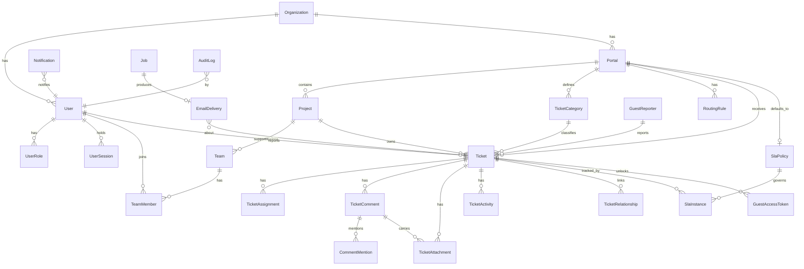

# Data Model

Internal identity is a UUID on every row. `Ticket.key` (`SUP-000251`) is the human identifier:
unique, immutable, indexed, used in URLs, emails and search.

## 1. Entity relationships

## 2. Table notes

**Identity & access**

- `User` — email (citext-style unique lowercase), `passwordHash?`, `externalId?` (for future
  OIDC), `status`, `mfaEnabled`, notification preferences JSON (validated by zod).
- `UserRole` — role _assignment_ is data (a user may hold several roles; the effective
  permission set is their union). The permission _matrix_ itself lives in code
  (`src/server/authz/permissions.ts`) so that a change to who may do what is reviewable,
  diffable and unit-tested cell by cell, rather than an untracked row edit in production.
- `GuestReporter` — name, email, optional phone/organisation. Deliberately _not_ a `User`: a
  guest has no credentials and no session beyond a ticket-scoped one.
- `GuestAccessToken` — `tokenHash` (SHA-256 of a 256-bit random token; the plaintext exists
  only in the email), `ticketId`, `expiresAt`, `usedAt?`, `revokedAt?`, `createdIp`. Never
  store the plaintext.

**Configuration (admin-editable, no deploys)**

- `Portal` — name, slug, description, url, `isActive`, `sortOrder`, `slaPolicyId?`. Teams and
  the target project are reached through `RoutingRule`, so routing stays in one place.
- `Project` — name, `keyPrefix` (nullable → falls back to the global `SUP`), portal, teams.
- `TicketCategory` — portal-scoped, ordered, active.
- `RoutingRule` — `portalId?`, `categoryId?`, `severityAtLeast?`, priority (specificity),
  targets: project, support team, QA team, engineering team. Evaluated most-specific-first.
- `SlaPolicy` — per severity: first-response minutes, resolution minutes, business-hours
  flag, warning threshold percentage. Unique on `(name, severity)`, so an organisation can
  run several named policies side by side.
- Severity and priority are database enums; their display labels and help text live in
  `src/lib/labels.ts`, so the vocabulary can be reworded without a migration while the stored
  values stay stable.

**Ticket core**

- `Ticket` — `key` (unique), `portalId`, `projectId?`, `categoryId?`, `status`, `severity`,
  `priority`, `title`, `description`, structured reporter context (`whatTrying`,
  `whatHappened`, `whatExpected`, `frequency`, `occurredAt`), environment (`browser`,
  `os`, `device`, `pageUrl`), reporter (`reporterUserId?` XOR `guestReporterId`), owners
  (`supportOwnerId?`, `qaOwnerId?`, `developerId?`), timestamps
  (`firstResponseAt?`, `resolvedAt?`, `closedAt?`, `reopenCount`), and `searchText` — a
  denormalised lower-cased blend of key, title, description and reporter, kept for search.
- `TicketAssignment` — history of who was assigned to which role slot and when (the current
  owner columns on `Ticket` are the fast path; this table is the audit trail).
- `TicketComment` — `visibility` (`PUBLIC | INTERNAL | QA_NOTE | DEV_NOTE | SYSTEM`),
  `bodyMarkdown` (stored raw, rendered by a sanitising renderer), `authorUserId?`,
  `guestReporterId?`, `editedAt?`. Mentions in `CommentMention`.
- `TicketAttachment` — `storageKey`, `filename`, `mimeType`, `sizeBytes`, `checksum`,
  `visibility`, `scanStatus` (`PENDING | CLEAN | INFECTED | SKIPPED`), uploader.
  Downloadable only via a signed, short-lived URL after a policy check.
- `TicketActivity` — immutable: `actorType`, `actorId?`, `action`, `field?`, `oldValue?`,
  `newValue?`, `visibility` (so the guest timeline can hide internal events).
- `TicketRelationship` — `type` (`DUPLICATE_OF | RELATED_TO | BLOCKED_BY | BLOCKS |
PARENT_OF | CHILD_OF`), `sourceTicketId`, `targetTicketId`, unique per (source,target,type).

**Operations**

- `SlaInstance` — per ticket: policy, `firstResponseDueAt`, `resolutionDueAt`,
  `firstResponseMetAt?`, `resolutionMetAt?`, `pausedAt?`, `pausedMs`, breach flags.
  Denormalised `state` (`OK | WARNING | BREACHED | MET`) for cheap filtering.
- `Notification` — recipient user, type, title, body, `ticketId?`, `readAt?`.
- `EmailDelivery` — template, to, subject, status (`QUEUED | SENT | FAILED | SUPPRESSED`),
  attempts, `providerMessageId?`, `error?`. Bodies are not stored (they may contain links).
- `Job` — `type`, `payload` JSON, `runAt`, `attempts`, `maxAttempts`, `status`
  (`PENDING | RUNNING | DONE | FAILED | DEAD`), `lockedAt/lockedBy`, `lastError`.
- `AuditLog` — `actorUserId?`, `actorType`, `action`, `entityType`, `entityId`, `before` JSON,
  `after` JSON, `ip`, `userAgent`. Append-only: the application role has no UPDATE/DELETE
  grant on this table in production.
- `TicketCounter` — one row per prefix; `nextValue` incremented under a row lock inside the
  ticket-creation transaction. Guarantees gapless, collision-free keys.
- `RateLimitBucket` — keyed counters for guest submission and token exchange throttling.

## 3. Indexing strategy

| Index                                                                | Serves                                           |
| -------------------------------------------------------------------- | ------------------------------------------------ |
| `Ticket(key)` unique                                                 | key lookup, email links                          |
| `Ticket(status, priority, createdAt desc)`                           | queue and board default ordering                 |
| `Ticket(portalId, status)` / `(projectId, status)`                   | per-portal, per-project boards                   |
| `Ticket(supportOwnerId, status)`, `(qaOwnerId,…)`, `(developerId,…)` | "my work" views                                  |
| `Ticket(reporterUserId, createdAt desc)`                             | user dashboard                                   |
| `Ticket(createdAt)`, `(resolvedAt)`                                  | reporting windows, aging                         |
| GIN (pg_trgm) on `Ticket.searchText`                                 | search over key + title + description + reporter |
| `TicketComment(ticketId, createdAt)`                                 | thread render                                    |
| `TicketActivity(ticketId, createdAt)`                                | timeline                                         |
| `SlaInstance(state, resolutionDueAt)`                                | breach sweeps                                    |
| `Job(status, runAt)` partial where status='PENDING'                  | queue claim                                      |
| `Notification(userId, readAt)`                                       | unread badge                                     |
| `GuestAccessToken(tokenHash)` unique                                 | token exchange                                   |

## 4. Integrity rules

- A ticket has exactly one reporter: `CHECK ((reporterUserId IS NULL) <> (guestReporterId IS NULL))`.
- `TicketActivity` and `AuditLog` are insert-only.
- Status changes go through the service layer; the DB additionally rejects unknown enum values.
- Assignment, comment, status change and resolution each write ticket + activity +
  notification + job **in one transaction**.
- Deletion is soft (`archivedAt`) for tickets; hard deletes are an admin-only, audited action.
