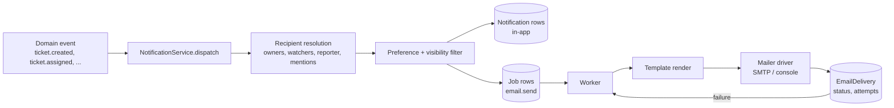

# Notification Architecture

One subsystem. No component, action or service sends mail directly.

## 1. Events and recipients

| Event                       | Reporter                 | Support owner   | QA owner | Developer | Team       | Leads              |
| --------------------------- | ------------------------ | --------------- | -------- | --------- | ---------- | ------------------ |
| `ticket.created`            | ✉ ack                    | ✉ if pre-routed | —        | —         | 🔔 queue   | —                  |
| `ticket.assigned.support`   | —                        | ✉🔔             | —        | —         | —          | —                  |
| `ticket.assigned.qa`        | —                        | 🔔              | ✉🔔      | —         | —          | —                  |
| `ticket.assigned.developer` | —                        | 🔔              | 🔔       | ✉🔔       | —          | —                  |
| `ticket.comment.public`     | ✉ (if not author)        | 🔔              | 🔔       | 🔔        | —          | —                  |
| `ticket.comment.internal`   | **never**                | 🔔              | 🔔       | 🔔        | —          | —                  |
| `ticket.info_requested`     | ✉                        | —               | —        | —         | —          | —                  |
| `ticket.status_changed`     | ✉ (public statuses only) | 🔔              | 🔔       | 🔔        | —          | —                  |
| `ticket.ready_for_qa`       | —                        | 🔔              | ✉🔔      | —         | 🔔 QA team | —                  |
| `ticket.resolved`           | ✉                        | 🔔              | 🔔       | 🔔        | —          | —                  |
| `ticket.closed`             | ✉                        | 🔔              | —        | —         | —          | —                  |
| `ticket.reopened`           | ✉                        | ✉🔔             | 🔔       | 🔔        | —          | 🔔                 |
| `sla.warning`               | —                        | ✉🔔             | 🔔       | —         | —          | 🔔                 |
| `sla.breached`              | —                        | ✉🔔             | ✉🔔      | —         | —          | ✉🔔                |
| `comment.mention`           | —                        | —               | —        | —         | —          | ✉🔔 mentioned user |

✉ email · 🔔 in-app

## 2. Hard rules

1. **Internal content never leaves the building.** The email payload builder accepts only
   `visibility = PUBLIC` comments. A unit test asserts that an internal comment produces no
   reporter-addressed job, and an integration test asserts the rendered body of a public
   notification contains no internal text.
2. **No self-notification.** The actor who caused an event is excluded from its recipients.
3. **Deduplication.** Recipients are a `Set` of user ids; a person who is both support owner
   and QA owner receives one notification.
4. **Preferences.** Per-user, per-event-type email toggles. In-app notifications are always
   written (they are the user's record); email respects preferences. Reporter acknowledgement
   and resolution emails are transactional and not suppressible.
5. **Transactional enqueue.** `Notification` and `Job` rows are inserted in the same
   transaction as the domain write. No event is ever lost or sent for a rolled-back change.

## 3. Templates

Rendered server-side to HTML + plain text, both always. Every reporter-facing template shows
ticket key, title, current status, what changed, and a **View ticket** button carrying a fresh
guest magic link (guests) or a normal deep link (registered users).

`ticket_received`, `ticket_updated`, `information_requested`, `ticket_assigned`,
`new_comment`, `ticket_resolved`, `ticket_closed`, `ticket_reopened`, `sla_escalation`.

Templates are pure functions `(data) => {subject, html, text}`, snapshot-tested. All
interpolated values are HTML-escaped; there is no user-controlled HTML in an email.

## 4. Delivery, retry, failure

- Job attempts: 5, backoff `1m, 5m, 15m, 1h, 6h`, then `DEAD` and visible on the admin job
  monitor.
- `EmailDelivery` records every attempt with provider message id or error; bodies are not
  stored (they contain access links).
- A permanent bounce marks the address `SUPPRESSED`; further sends are recorded, not attempted.
- Sending is idempotent per `(jobId)`: a worker crash after send but before commit results in a
  duplicate at most once, and templates are safe to receive twice.

## 5. In-app notification centre

Bell with unread count (indexed `Notification(userId, readAt)`), list with ticket deep links,
mark-one/mark-all read. Polled on an interval in MVP; the boundary is a single client hook, so
switching to SSE/WebSocket later changes one file.
