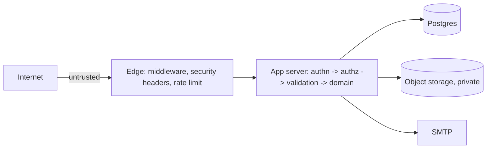
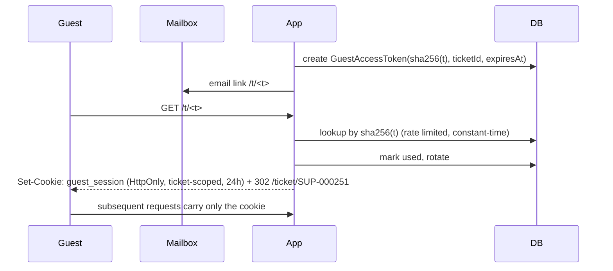

# Security Model & Threat Analysis

## 1. Trust boundaries

Everything from the browser is untrusted, including fields the UI marked read-only, hidden
inputs, and anything in a guest's possession.

## 2. Threat analysis (STRIDE, abbreviated to what matters here)

| #   | Threat                            | Vector                                                         | Mitigation                                                                                                                                                                                                                                                                                                                                           |
| --- | --------------------------------- | -------------------------------------------------------------- | ---------------------------------------------------------------------------------------------------------------------------------------------------------------------------------------------------------------------------------------------------------------------------------------------------------------------------------------------------- |
| T1  | **IDOR** — reading another ticket | `/tickets/<uuid>` or API id swap                               | Every read goes through `scopeFor(actor, permission)` which injects a SQL predicate. Guests are scoped to a single ticket id held in a signed, ticket-bound session. Unauthorised reads return 404, not 403                                                                                                                                          |
| T2  | **Ticket enumeration**            | Iterating `SUP-000001…`                                        | Ticket key alone grants nothing. Guest access requires the emailed token; failures are rate-limited per IP and per ticket, constant-time compared, and logged                                                                                                                                                                                        |
| T3  | **Guest token theft**             | Referrer leakage, shared browser, mail forwarding, log capture | Token is 256-bit random, stored only as SHA-256; the URL token is **exchanged once** for an `HttpOnly`, `SameSite=Lax`, ticket-scoped session cookie and then marked used; `Referrer-Policy: no-referrer`; configurable expiry (default 30 days), revocable per ticket; tokens never logged                                                          |
| T4  | **Internal comment disclosure**   | API response, email, guest timeline                            | Visibility filter applied in SQL, not in React. Email builder accepts only public content. Guest timeline requests only public activity. Covered by three separate tests                                                                                                                                                                             |
| T5  | **Privilege escalation**          | Forged role claim, client-side gate                            | Roles are read from the database per request, never from the cookie payload. No `role` value from the client is ever trusted                                                                                                                                                                                                                         |
| T6  | **Illegal state transition**      | Crafted request to `/api` or a server action                   | Transition table checked server-side with guards; the UI's option list is decoration                                                                                                                                                                                                                                                                 |
| T7  | **Malicious upload**              | Web shell, XSS via SVG/HTML, zip bomb, oversized file          | Allow-list of MIME types **and** extension, magic-byte sniff, size and count caps, random storage keys (never the user's filename), stored outside the web root, served with `Content-Disposition: attachment` + `X-Content-Type-Options: nosniff` + a restrictive CSP, SVG and HTML rejected, `scanStatus` gate blocks download until scanned (A10) |
| T8  | **XSS**                           | Comment body, ticket title, filename                           | No `dangerouslySetInnerHTML` of user input. Markdown rendered by a restricted renderer with an element/attribute allow-list; `javascript:`/`data:` URLs stripped. Strict CSP without `unsafe-inline` for scripts                                                                                                                                     |
| T9  | **CSRF**                          | Cross-site POST to a server action                             | `SameSite=Lax` cookies, origin check in middleware for all state-changing requests, Next.js server-action protection                                                                                                                                                                                                                                 |
| T10 | **Spam / bot flooding**           | Scripted guest submissions                                     | Turnstile/CAPTCHA on the guest form (configurable), per-IP and per-email token buckets, submission idempotency key, attachment quota per ticket, abuse counters surfaced to admins                                                                                                                                                                   |
| T11 | **Email abuse**                   | Using the portal to mail arbitrary addresses                   | Emails only ever go to the reporter's own address or staff addresses. No user-supplied recipients. Suppression list honoured                                                                                                                                                                                                                         |
| T12 | **Credential attacks**            | Password spraying, brute force                                 | bcrypt (cost 12), per-account and per-IP throttling with progressive lockout, uniform error messages, session rotation on login, MFA-compatible schema                                                                                                                                                                                               |
| T13 | **Session fixation / theft**      | Cookie replay                                                  | `HttpOnly`, `Secure`, `SameSite=Lax`, short-lived signed JWT with rotation, server-side revocation list for logout-all                                                                                                                                                                                                                               |
| T14 | **Audit tampering**               | Staff hiding an action                                         | `AuditLog` and `TicketActivity` are insert-only; the application database role has no UPDATE/DELETE grant on them in production                                                                                                                                                                                                                      |
| T15 | **Injection**                     | SQL, template                                                  | Prisma parameterised queries; the few raw aggregate queries use `$queryRaw` tagged templates (never string concatenation)                                                                                                                                                                                                                            |
| T16 | **SSRF**                          | Attacker-supplied URLs (`pageUrl`, future webhooks)            | `pageUrl` is stored and displayed, never fetched. Future integrations use an allow-list of egress hosts                                                                                                                                                                                                                                              |
| T17 | **Sensitive data in logs**        | Debug logging                                                  | Logger redacts `password`, `token`, `authorization`, `cookie`, `secret` by key, at the serialiser                                                                                                                                                                                                                                                    |

## 3. Guest access flow

The raw token never appears in an application log, and after the exchange it is inert.

## 4. Headers and transport

`Strict-Transport-Security`, `X-Content-Type-Options: nosniff`, `X-Frame-Options: DENY`,
`Referrer-Policy: no-referrer`, `Permissions-Policy` minimal, and a CSP with
`default-src 'self'`, no `unsafe-eval`, `frame-ancestors 'none'`, `object-src 'none'`.

## 5. Secrets and configuration

All secrets arrive as environment variables validated at boot by a zod schema
(`src/server/config/env.ts`); the process refuses to start if a required secret is missing or
a development default is detected in production. No secret is ever imported into client code —
only `NEXT_PUBLIC_` values cross that line, and the env schema separates the two.
