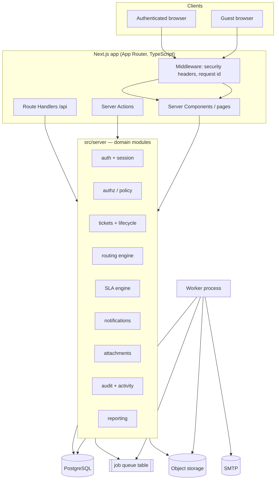
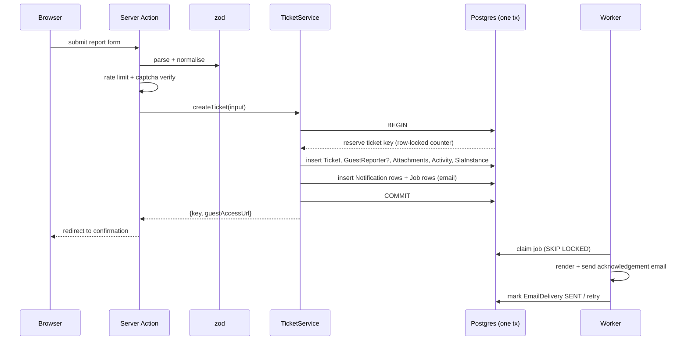

# System Architecture

## 1. Shape: modular monolith

One deployable Next.js application with strict internal module boundaries, plus one worker
process that drains the job queue. Microservices are not justified at this scale and would
buy distributed-transaction problems in exchange for nothing.



## 2. Technology choices and justification

| Concern       | Choice                                                                                                                      | Why                                                                                                                                                                                                                                                                               | Alternative rejected                                                                           |
| ------------- | --------------------------------------------------------------------------------------------------------------------------- | --------------------------------------------------------------------------------------------------------------------------------------------------------------------------------------------------------------------------------------------------------------------------------- | ---------------------------------------------------------------------------------------------- |
| Framework     | **Next.js 15, App Router, TypeScript strict**                                                                               | Mandated. RSC keeps ticket lists off the client; Server Actions give typed mutations without hand-written endpoints                                                                                                                                                               | Remix/Nest — not mandated                                                                      |
| Database      | **PostgreSQL 16**                                                                                                           | Relational workload (tickets ↔ assignments ↔ comments ↔ SLA), transactional integrity, partial/composite indexes, `tsvector` full-text search, `SKIP LOCKED` job queues, window functions for KPIs. Validated against the requirements: nothing here is document- or graph-shaped | MySQL (weaker FTS + no `SKIP LOCKED` ergonomics), Mongo (no transactional multi-entity writes) |
| ORM           | **Prisma 6**                                                                                                                | Typed client, first-class migrations, works with raw SQL where aggregates need it                                                                                                                                                                                                 | Drizzle (fine; Prisma's migration story is stronger for a team)                                |
| Auth          | **Own session layer**: bcrypt password hashes + JOSE-signed JWT in an `HttpOnly` cookie, behind an `AuthProvider` boundary  | No IdP named yet (A4). The boundary lets OIDC/SSO be added without touching call sites                                                                                                                                                                                            | NextAuth — heavier and still needs the IdP decision                                            |
| Email         | **nodemailer** behind a `Mailer` interface, console driver in dev, SMTP in prod                                             | Provider-neutral; swapping to SES/Resend is one driver                                                                                                                                                                                                                            | SDK lock-in                                                                                    |
| Storage       | **`Storage` interface**, local-disk driver now, S3 driver drop-in                                                           | Deployment target unknown (A7). Files never served from the web root                                                                                                                                                                                                              | Direct `public/` writes — publicly guessable                                                   |
| Jobs          | **Postgres-backed queue** (`Job` table, `FOR UPDATE SKIP LOCKED`), retries with exponential backoff and a dead-letter state | Avoids a second datastore; transactional enqueue in the same commit as the domain write — no lost or phantom jobs                                                                                                                                                                 | Redis/BullMQ — adds infrastructure and breaks transactional enqueue                            |
| Caching       | RSC/`fetch` cache + short-TTL in-process memo for configuration reads                                                       | Config is tiny and read-mostly                                                                                                                                                                                                                                                    | Redis — not yet needed                                                                         |
| Search        | Postgres trigram (`pg_trgm`) GIN index over a denormalised `searchText` column                                              | One datastore; adequate to millions of tickets, and upgradeable to `tsvector` full-text search without changing a call site                                                                                                                                                       | Elasticsearch — premature                                                                      |
| Observability | Structured JSON logger with request id, error boundary reporting, job + email delivery metrics                              | No vendor lock-in; ships to any collector                                                                                                                                                                                                                                         | —                                                                                              |
| Testing       | Vitest (unit + integration against a real Postgres), Playwright (E2E)                                                       | Fast unit loop, honest integration coverage                                                                                                                                                                                                                                       | Jest — slower under ESM/TS                                                                     |
| Deployment    | Docker image + `prisma migrate deploy`; app and worker from the same image                                                  | Runs anywhere; worker scales independently                                                                                                                                                                                                                                        | —                                                                                              |

## 3. Module boundaries

```
src/
  app/                     # routing + UI only. No business rules.
    (public)/              # landing, report, guest ticket
    (app)/                 # authenticated: dashboard, tickets, queue, admin
    api/                   # route handlers (attachments, jobs runner, health)
  components/              # presentational + small client islands
  server/
    auth/                  # sessions, password, guest tokens
    authz/                 # permission matrix + policy functions  <- single source of truth
    tickets/               # ticket service, lifecycle state machine, key generator
    routing/               # deterministic routing engine (AI-ready boundary)
    sla/                   # policy resolution, deadlines, business hours
    notifications/         # notification service + email templates
    attachments/           # validation, storage drivers, signed URLs, scan hooks
    audit/                 # activity + audit log writers
    reporting/             # KPI aggregates (raw SQL)
    jobs/                  # queue, handlers, worker
    db/                    # Prisma client
    validation/            # zod schemas shared by actions and API
    config/                # env validation, runtime configuration reads
  lib/                     # framework-free helpers (ids, dates, result types)
```

**Rules enforced by review and lint:**

- `app/` may call `server/*` services; it may not call Prisma directly.
- Authorisation lives only in `server/authz`. No `role === 'ADMIN'` checks in components.
- Notification sending lives only in `server/notifications`. No ad-hoc mail calls.
- Enums come from `@prisma/client` or `src/lib/enums.ts` — no magic strings.

## 4. Request lifecycle (ticket creation)



The email is never sent inside the transaction: a mail outage must not fail a ticket.

## 5. Failure behaviour

| Failure          | Behaviour                                                                                                                     |
| ---------------- | ----------------------------------------------------------------------------------------------------------------------------- |
| SMTP down        | Job retries with backoff (1m, 5m, 15m, 1h, 6h), then dead-letters and surfaces on the admin job monitor. Ticket is unaffected |
| Storage down     | Attachment upload fails with a field error; the ticket itself still submits                                                   |
| Worker down      | Jobs accumulate; `/api/jobs/run` (cron-protected) can drain them; queue depth is a monitored metric                           |
| Duplicate submit | Idempotency key on the report form prevents double tickets                                                                    |
| Partial write    | Impossible — ticket + activity + notification + job share one transaction (§41 of the brief)                                  |

## 6. Integration boundary (future)

External trackers are reached only through an `IssueTrackerAdapter`
(`createWorkItem`, `getWorkItem`, `onWebhook`) and a `TicketExternalLink` row. The core ticket
domain never imports a vendor SDK, so Jira/GitHub/GitLab/Zoho stay swappable.
