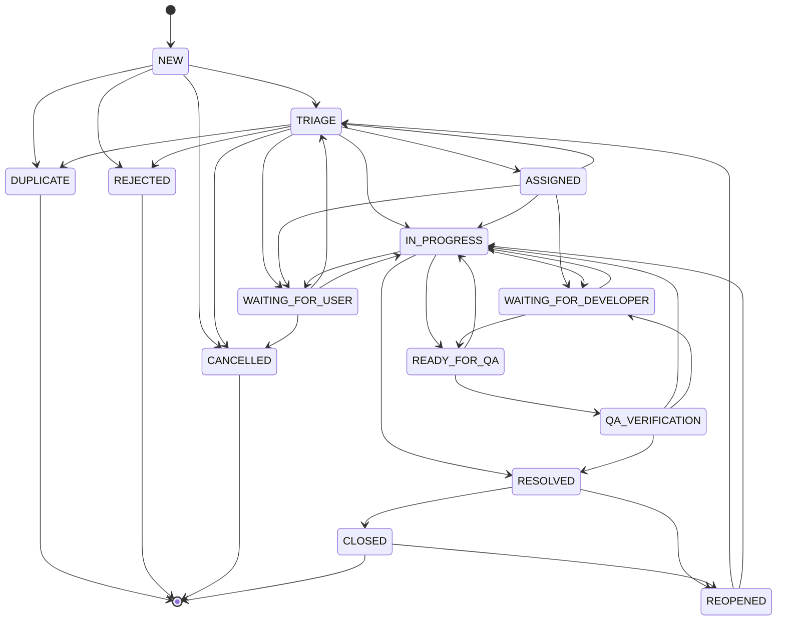

# Ticket Lifecycle

A closed state machine. Statuses are an enum; transitions are a table; both live in
`src/server/tickets/lifecycle.ts` and are enforced server-side. There is no free-text status.

## 1. States



## 2. Transition permissions

| From → To                        | Allowed actors                                      | Side effects                                                                                  |
| -------------------------------- | --------------------------------------------------- | --------------------------------------------------------------------------------------------- |
| `NEW → TRIAGE`                   | support, QA, leads, admin                           | records triage start                                                                          |
| `TRIAGE → ASSIGNED`              | support, QA, leads, admin                           | requires a support owner; notifies owner                                                      |
| `ASSIGNED                        | TRIAGE → IN_PROGRESS`                               | support, QA, assigned developer, leads, admin                                                 | —                                                                           |
| `* → WAITING_FOR_USER`           | support, QA, leads, admin                           | **pauses SLA**; emails the reporter an information request                                    |
| `WAITING_FOR_USER → previous`    | automatic on reporter reply; or staff               | **resumes SLA**                                                                               |
| `* → WAITING_FOR_DEVELOPER`      | support, QA, leads, admin                           | requires a developer; notifies developer                                                      |
| `IN_PROGRESS                     | WAITING_FOR_DEVELOPER → READY_FOR_QA`               | assigned developer, support, QA, leads, admin                                                 | notifies QA owner and QA team                                               |
| `READY_FOR_QA → QA_VERIFICATION` | QA, QA lead, admin                                  | records verification start                                                                    |
| `QA_VERIFICATION                 | IN_PROGRESS → RESOLVED`                             | QA, support, leads, admin                                                                     | sets `resolvedAt`, stops SLA, **emails the reporter**, schedules auto-close |
| `RESOLVED → CLOSED`              | reporter (confirm), staff, auto-close job           | sets `closedAt`, emails reporter                                                              |
| `RESOLVED                        | CLOSED → REOPENED`                                  | reporter within window, staff any time                                                        | `reopenCount++`, new SLA instance, notifies previous owners                 |
| `REOPENED → TRIAGE               | IN_PROGRESS`                                        | support, QA, leads, admin                                                                     | —                                                                           |
| `* → DUPLICATE`                  | support, QA, leads, admin                           | requires a `DUPLICATE_OF` relationship to the primary ticket; reporter may follow the primary |
| `* → REJECTED`                   | support lead, QA lead, admin                        | requires a reason; emails the reporter                                                        |
| `* → CANCELLED`                  | reporter (own, pre-resolution), support lead, admin | emails the reporter                                                                           |

Any transition not in the table is rejected with `InvalidTransitionError` — including
"forward" ones that look harmless, e.g. `NEW → RESOLVED`.

## 3. Guards

- **Required fields.** `TRIAGE → ASSIGNED` requires portal, category, severity, priority and a
  support owner. `→ READY_FOR_QA` requires a developer. `→ DUPLICATE` requires a primary.
  `→ REJECTED` requires a reason.
- **Terminal states.** `CLOSED`, `DUPLICATE`, `REJECTED`, `CANCELLED` accept no transition
  except `REOPENED` (from `CLOSED` only).
- **Reopen window.** `now - closedAt <= config.reopenWindowDays` for reporters; staff are
  exempt and the exemption is audited.
- **Idempotence.** Transitioning to the current status is a no-op, not an error, and writes no
  activity row.

## 4. Transactional side effects

Every transition is one transaction (§41 of the brief):

```
UPDATE ticket.status
  + INSERT TicketActivity(status, old→new)
  + INSERT TicketAssignment      (when ownership changed)
  + UPDATE SlaInstance           (pause/resume/meet)
  + INSERT Notification rows     (in-app)
  + INSERT Job rows              (emails)
  + INSERT AuditLog
```

If any part fails, none of it happened. A ticket can never show a status whose history is
missing.

## 5. First response

`firstResponseAt` is set once, by the first `PUBLIC` comment authored by staff, or by the
first transition out of `NEW` by staff — whichever comes first. It feeds the first-response
SLA and the "Average First Response Time" KPI.

## 6. Worked example (the MVP acceptance scenario)

```
09:01  guest submits            NEW          key SUP-000251, ack email queued
09:02  ack email sent           NEW          EmailDelivery SENT
09:15  support triages          TRIAGE       portal=Guardian, category=Payment, S2, P1
09:16  support owner set        ASSIGNED     Jane notified (in-app + email)
09:20  QA owner set             ASSIGNED     QA notified; firstResponseAt set by public reply
09:40  QA adds QA_NOTE          IN_PROGRESS  internal, never emailed to the reporter
10:05  developer assigned       WAITING_FOR_DEVELOPER  Michael notified
11:46  developer ready          READY_FOR_QA QA team notified
13:20  QA starts verification   QA_VERIFICATION
13:41  QA resolves              RESOLVED     resolution email to the guest, auto-close in 7d
13:42  resolution email sent    RESOLVED     guest may confirm (→ CLOSED) or reopen
```
